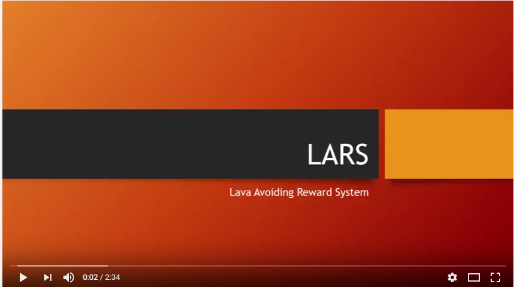

# Welcome to Project LARS
##### Source Code: [Github](https://github.com/ssaltzen/LARS)							 	 Class Website: [CS175](http://sameersingh.org/courses/aiproj/sp17/)						 		 Project Malmo: [Malmo](https://github.com/Microsoft/malmo)

### What is LARS?

LARS is an on going project for the CS175 course at University California, Irvine. Our goal is to explore various machine learning techniques and implement an interesting AI to interact with the world of Minecraft. The projects are based in Microsoft’s Malmo, which is a platform for interfacing with the Minecraft game that allows our AI agent to command and observe various world dynamics. 
For our project, we chose to create a reinforcement learning AI that can efficiently navigate around a maze of treacherous obstacles and find useful rewards. We do not supply our agent with any information about the world state and so it must “learn” how to behave through trial and error. This is a brief overvie of [Reinforcement Learning](https://en.wikipedia.org/wiki/Reinforcement_learning) .

[](https://youtu.be/fzii_TnV2Xg "LARS project video HD")


	
More specifically our AI is aganet that uses Q-Learningdescribed [here](https://en.wikipedia.org/wiki/Q-learning) with some variations. An example of our update function is below:

```python

def updateQTable(self, old_state):
        n = self.moveCount if self.moveCount < self.n else self.n
        cur_state = (tuple(self.world.rewardList), self.moveHistory[-1])
        for i in range(-n, 0):
            #for the past n state/action pairs
            G = self.rewardHistory[-1]
            G += self.gamma ** -(i+1) * self._optimalValue(cur_state)
            G-= self.qTable[old_state][self.actionHistory[-1]]
            G*= self.alpha
            self.qTable[old_state][self.actionHistory[-1]] += G
```


The AI is rewarded for collecting these items and is given a negative reward for taking time to get to the end as well as a negative reward for falling into lava.
Our ultimate goal is to make an AI the has a low training time and can learn medium sized mazed with relative haste.
{:height="360px" :width="640px"}
{:height="360px" :width="640px"}


