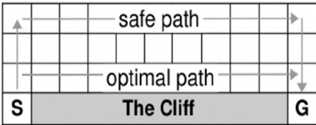
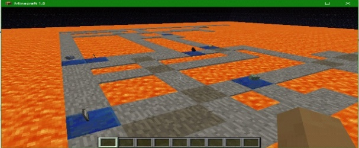

## Project Summary:
LARS (Lava Avoiding Reward Searcher) is a reinforcement-learning Minecraft AI. It is designed to navigate through a treacherous maze to figure out the best way to collect various items, craft a useful object and find the end of the maze in as little time as possible. The area surrounding the maze is lava, making missteps a very unhealthy venture. LARS does not receive any knowledge of the world prior to starting, and thus learns about its environment through trial and error exploration based on our own implementation of a Q-learning algorithm.

 
## Approach:
The general idea of our project is a more complex variation of the Cliff Walking problem proposed by Sutton and Barto. For simplicity’s sake, their problem can be casually described as an agent positioned at the edge of cliff whose task is to make its way across the ledge using the shortest path without falling off. (see fig. 1) This problem is then solved with a variety of AI algorithms. We have taken that basic problem and expanded the concept into a maze surrounded by lava, functioning as a more complex path to solve and much more “cliff” to avoid (see fig. 2) which is then evaluated  using reinforcement learning. 
The parameters of our problem frame are as follows:
*	A maze is generated through lava with N items placed randomly upon it
*	An agent is placed in the maze with no knowledge of its environment
*	The agent has four movement actions and the option to craft
*	The agent is timed to see how long it takes to find items and solve the maze
*	If the agent walks off the maze and lands in lava, it dies and the episode is restarted
*	Touching lava blocks gives a large negative reward to the agent
*	Items each have a positive reward associated with them
	A small negative reward is assigned each time the agent preforms an action to encourage it find the most efficient solution.
*	Episodes are run continuously until the agent converges to find the best policy for that maze.
*	The mission ends and returns statistics regarding the agent's performance.

To start our project, we created a dynamic maze generator that allows us to adjust the difficulty and size of the maze, as well as location/number of the rewards and its tendency towards a more linear path or one with many branches. By changing the maze setting we can vary the difficulty of our problem which give us the tools to thoroughly test and stress our algorithm’s capabilities and performance
Our agent uses tabular Q-learning for its decision making algorithm.  We chose to implement the code ourselves to allow for greater flexibility as we progress. However, presently, our algorithm is a fairly standard application of the algorithm. Q-learning can be used to find an optimal action-selection policy for any given (finite) Markov decision process. We represent our world with a MDP that uses its location and inventory contents as states. The number of states varies greatly with the size of the maze, lava content within the maze and number of items we have placed for LARS to find. In general, the baseline number of states for an n by m maze will be approximately ((n × m)- lava content) modified by the number of items. Our action set (at the moment) consists of four actions: move north, south, east or west by one block. Touching a lava block results in a reward of -100, obtaining an item gives rewards of 20-100 and while there are no rewards associated with stone blocks, each time an action is made it receives a reward of -1 to promote finding the most efficient path. As the agent takes actions it updates the Q-table for that state and uses this update function to evaluate the rewards:
```python
def updateQTable(self, old_state):
          n = self.moveCount if self.moveCount < self.n else self.n
          cur_state = (tuple(self.world.rewardList), self.moveHistory[-1])
          for i in range(-n, 0):
              #for the past n state/action pairs
              G = self.rewardHistory[-1]
              G += self.gamma ** -(i+1) * self._optimalValue(cur_state)
              G-= self.qTable[old_state][self.actionHistory[-1]]
              G*= self.alpha
              self.qTable[old_state][self.actionHistory[-1]] += G
```
The rest of the algorithm evaluates the expected reward of taking a given action in a state and then executes the optimal policy for that state with a chance for random action. As it makes moves it continually updates the Q-table until it reaches convergence to the final solution. 



(figure 1)

 
(figure 2)

## Evaluation:
Our evaluation is based mostly recording and analyzing information about the AI’s positions, values and action choices through a printed log and observational conclusions by manually watching it progress through the maze. Generally, we have found that simple empirical evaluation of the agent tends to provide enough information for most of the basic developmental purposes. For example, it is easy to tell when the agent is not preforming properly, as it will not progress very far in the maze, get stuck repeating the same actions with no variation or ignore the reward items. When debugging the agent or setting up basic parameters, visual evaluation provides quick and effective benchmarks to assess baselines of performance.	Once we have assessed the agent to be preforming adequately, we try to evaluate and/or optimize the algorithm's performance by turning to the output logs. A typical log file contains records such as the following:
```
Waiting for the mission to start
last move stats:
 - self.actionHistory = [(0, -1, 0)]
 - self.rewardHistory = [-101.0]
 - self.rewardsLooted = []
 - self.moveHistory = [(0.5, 227, 0.5), (0.5, 226, 0.5)]
 - self.world.totatlRewards = -101.0
 - self.world.lastReward = -101.0
Waiting for the mission to start
last move stats:
 - self.actionHistory = [(0, -1, 0), (0, 1, 0)]
 - self.rewardHistory = [-101.0, -1.0]
 - self.rewardsLooted = []
 - self.moveHistory = [(0.5, 227, 0.5), (0.5, 226, 0.5), (0.5, 227, 0.5)]
 - self.world.totatlRewards = -1.0
 - self.world.lastReward = -1.0
last move stats:
 - self.actionHistory = [(0, -1, 0), (0, 1, 0), (-1, 0, 0)]
 - self.rewardHistory = [-101.0, -1.0, -101.0]
 - self.rewardsLooted = []
 - self.moveHistory = [(0.5, 227, 0.5), (0.5, 226, 0.5), (0.5, 227, 0.5), (-0.5, 227, 0.5)]
 - self.world.totatlRewards = -102.0
 - self.world.lastReward = -101.0
```
We can then follow the algorithms execution by hand to more solidly determine that the agent is behaving exactly as expected and then establish finer points to tune for maximum performance. 

At the moment, LARS is capable of navigating around a maze with relative efficiency while prioritizing the collection of items. However, as detailed in the next section, we hope to add in some more aspects of the challenge that will allow us to collect more meaningful statistics and complicated success states. 
 
## Remaining Goals and Challenges:
Currently, LARS is a simple maze runner modified to find several rewards along the way. Our reach goal is to give LARS more agency to interact with objects it collects and a more distinctive end goal. However, before we can start expanding LARS' capabilities we need to a better way to asses our performance. 
To do so we will first make the maze "solvable". This will take provided us with an easily calculated termination state (and therefore better evaluation mechanics) and more well-defined end goal. At the moment, LARS does not particularly interact with the maze, it is treated more a collections of hazards to avoid and positive steps to take. LARS currently starts at the (0,0) coordinates and wanders around from there. We plan to add an ending block to the maze that will provided the highest rewards but only if LARS has collected all the items. Implementing this will add a few obstacles for us, as we will have to define the end state and when that is valid before quitting the mission, but is certainly doable. 
Once we have instantiated an end to the maze, we would like to improve our evaluation methods. The first step will be to add timer to see how long LARS takes to solve the maze over all episodes of the algorithm. We may also add some code to solve the generated maze's shortest path tree to all the items and the cross reference the path that the agent learns, with a measure of how far it deviates from that path. The information will provide us with a clear measure of performance to start benchmarking and improving our agent. 
Once that is complete we can optimize the learning algorithm. This should not be a terribly challenging, as it mostly consists of tweaking the controlling variable for the Q-learning to find the best set of parameters but we will need to allocate sufficient time to run the algorithm for multiple instances and evaluate each performance across an average of the runs for each change.
After that, we would like to add crafting to give meaning to the objects that LARS collects as our reach goal. There are several ways to do this, we have not yet settled on the best implementation but are considering the following: we could have LARS add crafting as a basic action, so that it will randomly tries to craft things as it picks up item on the maze while knowing the recipes, or possibly have it make attempts at crafting until it learns the recipe for an item, or make crafting the item the prerequisite for ending the maze. This part will be very challenging regardless of how we implement it, because in order to add crafting we will have overcome some limitations in our current implantation. At the moment, LARS makes decisions with fairly generic Q-Table by choosing the best possible action for its given state, but by adding crafting our possible actions and number of states will increase dramatically. This might be handled by adding another Q-table for crafting related actions, using a different way to represent the states and actions or by choosing a specific circumstance to allow crafting. Regardless of how we implement crafting or change our algorithm, this likely constitutes our greatest challenge for the final submission.

